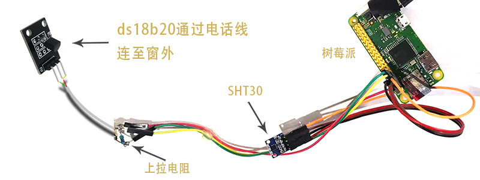
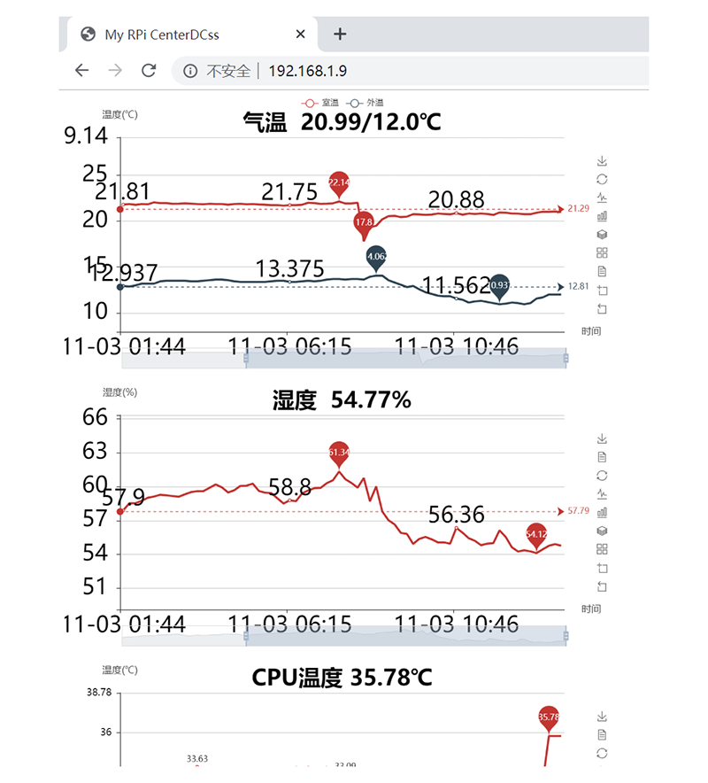

# 树莓派 + pyecharts 气象数据收集与可视化

这个小“项目”已经稳定运行近2年了。主要特性是树莓派将收集的室内温度、湿度和室外温度以及CPU温度等数据存入sqlite数据库，利用pyecharts进行数据可视化，用ngix做服务器，可通过网页浏览。申请公网IP后，外出时也可以查看数据。

## 硬件清单

1. 树莓派 Zero W
2. ds18b20(ds1302)模块
3.  sht30模块

## 软件清单

1. python
2. pyecharts
3. ngix

## 硬件搭设

树莓派 zero w价格便宜，自带wifi模块，功能强大。到手后刷入官方lite版系统，不需要桌面。具体请参考教程，“[无屏幕和键盘配置树莓派WiFi和SSH](http://shumeipai.nxez.com/2017/09/13/raspberry-pi-network-configuration-before-boot.html)”。

室外温度采用ds18b20模块，此模块为“单总线模块”，数据和电源共用一条线，加上地线共两条线，正好一根据电话线即可，接线见下图。

sht30是盛世瑞恩出产的一款基于i2c传输协议的温、湿度传感器，联线比较简单，唯一需要注意的是它的电压是3.3V，不要接到5V上去了。

## 运行效果

## 文档

详细说明见[树莓派 + pyecharts 气象数据收集与可视化](https://lemodd.github.io/post/shu-mei-pai-pyecharts-qi-xiang-shu-ju-shou-ji-yu-ke-shi-hua)。
